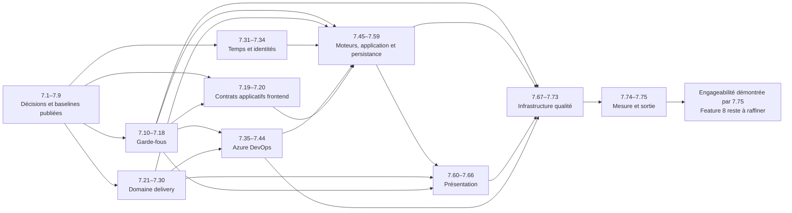

# Décision d’architecture — Séquence de migration acyclique

## Statut, autorité et portée

- **Statut :** acceptée
- **Date :** 22 août 2026
- **Autorité des outcomes et précédences directes :**
  [`feature-07-evolvable-architecture.md`](backlog-expectations/feature-07-evolvable-architecture.md)
- **Projection machine des vagues, chemins et convergences :**
  [`architecture-migration-sequence.json`](../reports/architecture-migration-sequence.json)
- **Cible à atteindre :** [`target-architecture.md`](target-architecture.md)

Cette décision ordonne les outcomes de la Feature 7 sans en réaliser un seul. Elle ne déplace aucun fichier,
n’implémente aucun port, ne retire aucun import ou cycle et ne modifie aucun comportement produit. Les
autorités actuelles restent celles de l’architecture exécutée, du graphe factuel et du registre des données
structurantes jusqu’au basculement atomique porté par chaque outcome concerné.

## Modèle de publication

Le graphe `G = (V, E)` contient les 75 outcomes de la Feature 7. Une arête `A → B` signifie que `A` est un
prédécesseur obligatoire de `B`. Les PBI 7.1 à 7.9 forment l’état initial publié `S0`. Les PBI 7.10 à 7.75
forment le graphe de migration restant.

Un état intermédiaire `S` est publiable si et seulement si :

1. il est **fermé vers ses prédécesseurs** : tout outcome présent dans `S` possède tous ses prédécesseurs dans
   `S` ;
2. chaque outcome ajouté a été intégré par un commit autonome avec sa preuve locale et la validation
   canonique verte ;
3. le comportement produit, les autorités non migrées et les garanties statistiques restent inchangés ;
4. aucun chantier ne dépend d’un contrat ou d’un chemin qui ne serait publié que par un futur outcome.

Un PBI est prêt dès que tous ses prédécesseurs sont publiés. Les vagues ci-dessous sont les niveaux
topologiques les plus précoces, pas des lots de publication : il ne faut jamais attendre les autres PBI d’une
vague pour intégrer un outcome prêt. Cette lecture préserve le maximum de parallélisme sûr et l’intégration
asynchrone prescrite par [`AGENTS.md`](../AGENTS.md).

## Front immédiatement parallélisable après 7.9

Six PBI deviennent réalisables en parallèle dès la publication de 7.9 :

| PBI | Outcome indépendant immédiatement disponible | Frontière |
| --- | --- | --- |
| 7.10 | L’autorité des dépendances est lisible et diagnostiquable automatiquement | Contrôle architectural |
| 7.21 | L’événement de delivery porte un fait métier normalisé | Domaine delivery |
| 7.31 | Le temps frontend est injectable et déterministe | Temps frontend |
| 7.32 | Le temps backend est injectable et déterministe | Temps backend |
| 7.33 | L’identité des historiques est injectable | Identité backend des historiques |
| 7.34 | L’identité du client frontend est injectable | Identité cliente frontend |

Ils ne partagent aucune précédence future. Leurs éventuels conflits documentaires de registre se résolvent
par resynchronisation sur le dernier `origin/main` ; ils ne constituent pas une dépendance architecturale.

## Graphe des outcomes et vagues minimales

La vue suivante rend les chemins et leurs principales convergences. Elle ne remplace pas les arêtes directes
exhaustives de la section suivante.



| Vague minimale | Outcomes publiables dès que leurs seuls prédécesseurs sont présents |
| ---: | --- |
| 1 | 7.10, 7.21, 7.31, 7.32, 7.33, 7.34 |
| 2 | 7.11, 7.12, 7.13, 7.14, 7.15, 7.16, 7.22, 7.23 |
| 3 | 7.17, 7.19, 7.20, 7.24, 7.28, 7.29, 7.35, 7.36, 7.37, 7.38, 7.39, 7.45, 7.46, 7.48, 7.67 |
| 4 | 7.18, 7.25, 7.26, 7.27, 7.40, 7.41, 7.42, 7.47, 7.49, 7.50, 7.68 |
| 5 | 7.30, 7.43, 7.69 |
| 6 | 7.44, 7.51, 7.70 |
| 7 | 7.52, 7.55 |
| 8 | 7.53, 7.56, 7.57, 7.60 |
| 9 | 7.54, 7.58, 7.61 |
| 10 | 7.59, 7.62, 7.63 |
| 11 | 7.64 |
| 12 | 7.65 |
| 13 | 7.66 |
| 14 | 7.71 |
| 15 | 7.72, 7.73 |
| 16 | 7.74 |
| 17 | 7.75 |

## Dépendances obligatoires exhaustives

`B ← A` signifie que `B` exige l’état publié `A`. Aucun ordre numérique, aucune vague complète et aucun
chemin voisin n’ajoutent une précédence implicite.

```text
7.10 ← 7.7, 7.8
7.11 ← 7.10
7.12 ← 7.10
7.13 ← 7.10
7.14 ← 7.10
7.15 ← 7.6, 7.10
7.16 ← 7.6, 7.10
7.17 ← 7.11, 7.12, 7.13, 7.14, 7.15, 7.16
7.18 ← 7.17
7.19 ← 7.8, 7.9, 7.13
7.20 ← 7.8, 7.9, 7.12
7.21 ← 7.6, 7.8, 7.9
7.22 ← 7.21
7.23 ← 7.21
7.24 ← 7.22, 7.23
7.25 ← 7.21, 7.22, 7.23, 7.24
7.26 ← 7.21, 7.22, 7.23, 7.24
7.27 ← 7.21, 7.22, 7.24
7.28 ← 7.21, 7.23
7.29 ← 7.21, 7.23
7.30 ← 7.24, 7.27, 7.28, 7.29
7.31 ← 7.8, 7.9
7.32 ← 7.8, 7.9
7.33 ← 7.8, 7.9
7.34 ← 7.8, 7.9
7.35 ← 7.8, 7.9, 7.15
7.36 ← 7.8, 7.9, 7.15
7.37 ← 7.8, 7.9, 7.15
7.38 ← 7.8, 7.9, 7.15
7.39 ← 7.8, 7.9, 7.15
7.40 ← 7.15, 7.21, 7.38, 7.39
7.41 ← 7.35
7.42 ← 7.35
7.43 ← 7.35, 7.36, 7.41, 7.42
7.44 ← 7.35, 7.36, 7.37, 7.38, 7.39, 7.40, 7.43
7.45 ← 7.8, 7.9, 7.11
7.46 ← 7.8, 7.9, 7.11
7.47 ← 7.46
7.48 ← 7.8, 7.9, 7.15
7.49 ← 7.32, 7.48
7.50 ← 7.48
7.51 ← 7.30, 7.35, 7.36, 7.37, 7.38, 7.39, 7.40, 7.48
7.52 ← 7.19, 7.25, 7.26, 7.45, 7.46, 7.47, 7.51
7.53 ← 7.20, 7.31, 7.34, 7.52
7.54 ← 7.31, 7.34, 7.41, 7.42, 7.43, 7.46, 7.47, 7.52, 7.53
7.55 ← 7.32, 7.33, 7.45, 7.48, 7.49, 7.50, 7.51
7.56 ← 7.12, 7.55
7.57 ← 7.45, 7.55
7.58 ← 7.48, 7.49, 7.50, 7.55, 7.57
7.59 ← 7.19, 7.20, 7.52, 7.53, 7.54
7.60 ← 7.30, 7.52
7.61 ← 7.53
7.62 ← 7.60, 7.61
7.63 ← 7.60, 7.61
7.64 ← 7.62, 7.63
7.65 ← 7.63, 7.64
7.66 ← 7.12, 7.60, 7.61, 7.64, 7.65
7.67 ← 7.3, 7.8, 7.11, 7.12
7.68 ← 7.67
7.69 ← 7.67, 7.68
7.70 ← 7.17, 7.67, 7.68, 7.69
7.71 ← 7.18, 7.44, 7.56, 7.58, 7.59, 7.66, 7.70
7.72 ← 7.71
7.73 ← 7.17, 7.71
7.74 ← 7.5, 7.71, 7.72, 7.73
7.75 ← 7.40, 7.43, 7.44, 7.51, 7.71, 7.72, 7.73, 7.74
```

Le contrôle automatisé recalcule ces arêtes depuis les attendus. Cette restitution humaine n’est donc pas
une seconde autorité modifiable indépendamment.

## Chemins parallèles

| Chemin | Outcomes | Contrat ou état de convergence |
| --- | --- | --- |
| Garde-fous architecturaux | 7.10–7.18 | Contrôle commun dans les profils locaux et `main` |
| Contrats applicatifs frontend | 7.19–7.20 | `TeamForecast` et `PortfolioForecast` indépendants de React |
| Domaine delivery | 7.21–7.30 | Résultat delivery et diagnostics sans DTO Azure DevOps |
| Temps et identités | 7.31–7.34 | Ports techniques séparés, sans façade agrégée |
| Azure DevOps | 7.35–7.44 | Ports communs ; Cloud et Server/TFS restent indépendants |
| Moteurs, application et persistance | 7.45–7.59 | Ports moteurs, cas d’usage et composition roots |
| Présentation | 7.60–7.66 | API publique des modèles ; React, PDF et CSV indépendants |
| Infrastructure qualité | 7.67–7.73 | Surfaces produit publiques et même autorité de contrôle |
| Sortie de Feature | 7.74–7.75 | Remesure puis preuve d’engageabilité de Feature 8 |

Deux PBI d’un même chemin restent parallélisables lorsque leurs prédécesseurs directs le permettent. Les
bornes de chemin n’imposent aucun verrou supplémentaire.

## Points de convergence

| Point | Convergence publiable obtenue |
| --- | --- |
| 7.17 | Les six familles de règles utilisent l’autorité commune dans les profils locaux et `main`. |
| 7.30 | Les diagnostics de complétude, discontinuité et chronologie traversent la frontière applicative. |
| 7.44 | Tous les ports Azure DevOps ont convergé et les accès techniques directs sont bloqués. |
| 7.51 | Delivery, Azure DevOps et persistance alimentent le cas d’usage `TeamHistory`. |
| 7.52 | Contrat frontend, calculs delivery, moteurs et historique convergent dans `TeamForecast`. |
| 7.53 | Configuration, temps, identité et prévision équipe convergent dans `PortfolioForecast`. |
| 7.54 / 7.55 | Les compositions frontend et backend assemblent séparément leurs seuls ports applicatifs. |
| 7.58 | Persistance, limitation et composition backend quittent la route HTTP. |
| 7.66 | UI et rapports convergent sur l’API publique de présentation. |
| 7.70 | L’orchestration qualité converge sur ses composants et les preuves produit publiques. |
| 7.71 | Toutes les frontières migrées convergent dans la preuve workspace. |
| 7.74 | Workspace, worktree et CI convergent dans la remesure du coût de changement. |
| 7.75 | L’ensemble converge dans la preuve de sortie de Feature 7. |

## États intermédiaires publiables

Chaque fusion d’un unique PBI prêt produit un nouvel état publiable ; aucune vague n’est un commit collectif.
Les jalons suivants donnent des noms pratiques à certains états sans ajouter de précédence :

| Jalon | État minimal qui le rend observable |
| --- | --- |
| `S0` | 7.1–7.9 : baselines, directions, cible et séquence acceptées ; aucune migration réalisée. |
| `S-control` | 7.10–7.18 publiés : garde-fous exploitables avant les migrations qui les exigent. |
| `S-delivery` | 7.21–7.30 publiés : domaine delivery autonome et diagnostics conservés. |
| `S-ado` | Prédécesseurs de 7.44 et 7.44 publiés : accès Azure DevOps confinés. |
| `S-application` | Prédécesseurs de 7.59 et 7.59 publiés : orchestration hors hooks et routes. |
| `S-presentation` | Prédécesseurs de 7.66 et 7.66 publiés : restitutions derrière une API stable. |
| `S-quality` | Prédécesseurs de 7.70 et 7.70 publiés : qualité découplée du produit. |
| `S-verified` | 7.71, puis 7.72 et 7.73 publiés : preuves workspace, worktree et CI disponibles. |
| `S-exit` | 7.74 puis 7.75 publiés : coût remesuré et engageabilité de Feature 8 démontrée. |

Un état contenant seulement une partie d’un jalon reste publiable dès lors qu’il est fermé vers ses
prédécesseurs. La publication asynchrone est donc la règle, le jalon seulement une lecture de synthèse.

## Stratégie de retour arrière

Le rollback conserve la même fermeture du graphe que la progression :

1. **avant publication**, abandonner uniquement la branche et le worktree du PBI ; l’état partagé ne change
   pas ;
2. **après publication sans descendant publié**, revenir sur le commit atomique du PBI, y compris sa mise à
   jour d’autorité et sa preuve, puis repasser la validation canonique ;
3. **avec descendants publiés**, identifier tous les descendants déjà intégrés et les retirer en ordre
   topologique inverse avant leur prédécesseur ; ne jamais conserver un consommateur d’un contrat retiré ;
4. **si le retour détruirait un état publiable**, privilégier un correctif en avant porté par un outcome
   explicite ou une nouvelle décision d’architecture au lieu de réintroduire une dépendance interdite.

Pour une donnée structurante, l’autorité actuelle reste seule active jusqu’au basculement complet de ses
producteurs et consommateurs. Un rollback remet en place tout le basculement atomique ; une double écriture,
une double lecture ou un alias transitoire ne deviennent jamais une seconde autorité. Pour les chemins
statistiques, le même standard, le même corpus, le même rejeu exact, la même preuve distributionnelle et le
même profil `main` restent bloquants avant et après retour arrière.

## Validation automatisée

Le contrôle ciblé s’exécute avec :

```powershell
python Scripts/check_architecture_migration_sequence.py
```

Il vérifie automatiquement :

- la couverture exacte des 75 outcomes et l’existence de chaque prédécesseur ;
- l’absence de cycle direct ou indirect ;
- la fermeture de tous les PBI déjà datés dans le backlog vers leurs prédécesseurs ;
- le placement de chaque outcome dans sa vague topologique la plus précoce ;
- l’exactitude des six PBI immédiatement parallélisables après 7.9 ;
- l’affectation unique de chaque outcome restant à un chemin ;
- l’existence et le caractère réellement convergent des points déclarés.

Les tests injectent un cycle, retardent artificiellement un outcome disponible, retirent un prédécesseur
d’un état publié et dupliquent une affectation de chemin. Le profil canonique conserve par ailleurs toutes
les preuves produit et statistiques existantes.

## Garanties et hors périmètre

Cette décision ne change ni modes de simulation, ni filtrage, ni bornes, ni censure à 521 semaines, ni
percentiles, ni Risk Score, ni fiabilité, ni histogrammes, ni complétion. Seed uint32, PRNG contractuel, ordre
des tirages, batching, corpus, rejeu exact, preuve distributionnelle, compatibilité et enforcement `main`
restent inchangés.

Sont hors périmètre : création des frontières physiques, implémentation d’un port, migration d’un
consommateur, retrait d’un chemin historique, suppression d’un cycle produit, changement d’API ou de
persistance, modification d’un comportement fonctionnel et réduction d’une gate.
