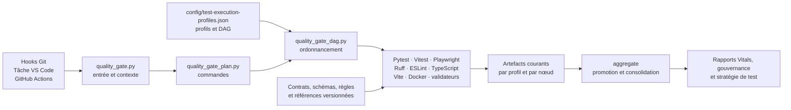

# Cartographie des responsabilités de l’infrastructure qualité

Cette carte décrit l’état observé de l’infrastructure qualité au commit
`4bc9b01fce83682da3e7dbd79df898461a2437b4`. Elle attribue les responsabilités réellement exercées par les
profils, scripts, runners et artefacts, sans proposer de cible ni modifier un contrôle. Les recouvrements et
couplages recensés sont donc des constats, pas des décisions de rationalisation.

## Vocabulaire de lecture

| Responsabilité | Question traitée | Exemples observés |
| --- | --- | --- |
| **Preuve** | Quel fait contrôlé est conservé ou attesté ? | rapports de couverture, inventaire de tests, résultats natifs, preuves statistiques et attestations |
| **Orchestration** | Quels contrôles sont sélectionnés, ordonnés, isolés et agrégés ? | résolution du profil, plan de commandes, DAG, snapshots, transfert d’artefacts CI |
| **Exécution** | Quel outil exerce le produit ou inspecte les sources ? | Pytest, Vitest, Playwright, Ruff, ESLint, TypeScript, Vite, Docker et scripts de contrôle |

Un même composant peut actuellement porter plusieurs de ces responsabilités. La colonne « responsabilité
réelle » des inventaires ci-dessous rend ces cumuls explicites.

## Vue d’ensemble exécutée



L’autorité déclarative du graphe est
[`config/test-execution-profiles.json`](../config/test-execution-profiles.json). Le plan de commandes est
construit séparément par [`Scripts/quality_gate_plan.py`](../Scripts/quality_gate_plan.py) et le sous-plan
statistique par [`Scripts/quality_gate_statistical_plan.py`](../Scripts/quality_gate_statistical_plan.py).
Chaque libellé de commande matérialisé doit être attribuable à un unique nœud du contrat avant que
[`Scripts/quality_gate_dag.py`](../Scripts/quality_gate_dag.py) ne l’exécute.

## Quality gates, modes et profils

Les modes décrivent le point d’entrée et la source contrôlée. Les profils décrivent le patrimoine de tests et
les nœuds actifs. Les niveaux `targeted`, `impacted` et `massive` restent une troisième dimension : ils
sélectionnent la portée d’un changement mais ne remplacent pas un profil.

| Entrée réelle | Profil résolu | Source et isolation | Portée effectivement construite |
| --- | --- | --- | --- |
| `.githooks/pre-commit` → `quality_gate.py fast` | `pr` | snapshot temporaire de l’index Git ; modifications non indexées absentes | contrôles de base, puis documentation seule ou tests ciblés/impactés ; repli complet si changement `massive` |
| `.githooks/pre-push` → `quality_gate.py push` | `main` | chaque SHA terminal introduit dans un worktree détaché temporaire | sélection adaptative sur les chemins des commits ; le sous-DAG complet n’est présent que si le changement est `massive` |
| pull request GitHub → `ci --profile pr --node …` | `pr` | checkout de `${{ github.sha }}` propre à chaque job | plan complet du profil `pr` : préflight, statique, Pytest et Vitest sans couverture ; les nœuds sans commande écrivent néanmoins un résultat de nœud |
| tâche VS Code `Validation : profil main` → `ci --profile main` | `main = pr + main` | copie temporaire des fichiers suivis et des fichiers non suivis non ignorés ; `.env` inclus s’il existe ; `node_modules` hôte exposé temporairement | les 36 commandes matérialisées, le smoke Docker et l’agrégation, exécutés en DAG parallèle |
| push GitHub sur `main` → `ci --profile main --node …` | `main = pr + main` | checkout de `${{ github.sha }}` par job, sans snapshot supplémentaire pour un nœud sélectionné | mêmes nœuds et commandes, distribués entre jobs avec transfert des artefacts |
| événement planifié → `ci --profile nightly --node …` | `nightly = pr + main + nightly` | checkout CI par job | même graphe de nœuds ; sélection des cas classés `nightly` ajoutée au patrimoine hérité |
| publication GitHub → `ci --profile release --node …` | `release = pr + main + release` | checkout CI par job | même graphe de nœuds ; sélection des cas classés `release` ajoutée au patrimoine hérité |

La tâche canonique locale est définie une fois dans [`.vscode/tasks.json`](../.vscode/tasks.json) :

```powershell
.\.venv\Scripts\python.exe Scripts/quality_gate.py ci --profile main
```

Les tâches VS Code spécialisées et les scripts `npm` exposent aussi des exécutions unitaires, de couverture,
E2E ou Vitals. Elles produisent une preuve partielle et ne traversent pas l’agrégateur du profil `main`.

## Nœuds du DAG et responsabilités

| Nœud | Dépendances structurantes | Responsabilité réelle | Preuves courantes principales |
| --- | --- | --- | --- |
| `preflight` | aucune | hygiène du dépôt, backlog, classification des tests, frontière d’identité, nommage et ratchet de maintenabilité | `preflight/result.json` |
| `backend-static` | `preflight` | exécution Ruff | `backend-static/result.json` |
| `statistical-authorities` | `preflight` ; absent de `pr` | validation des autorités, du corpus, des sondes et du protocole distributionnel | attestations `authority`, `corpus` et `protocol` |
| `statistical-deterministic-parity` | autorités statistiques | production de la parité déterministe Python/TypeScript puis enforcement | `parity.json`, `parity.md`, `attestation.json` |
| `statistical-exact-replay` | autorités statistiques | production du rejeu exact et du batching puis deux enforcements | `evidence.json`, attestations `exact` et `batching` |
| `statistical-distributional-parity` | autorités statistiques | production multi-seeds puis enforcement distributionnel | `evidence.json`, `attestation.json` |
| `statistical-compatibility` | trois branches de preuve statistique | production de la compatibilité à partir des preuves courantes puis enforcement de version | `evidence.json`, `attestation.json` |
| `statistical-consolidated-report` | preuves et compatibilité | génération JSON/Markdown puis validation indépendante de schéma, empreinte, fraîcheur et sources | `report.json`, `report.md`, `attestation.json` |
| `frontend-static` | `preflight` | ESLint, typecheck et build Vite | `dist/`, `frontend-static/result.json` |
| `backend-tests` | `preflight` | sélection du profil Pytest, exécution avec couverture, contrôle de périmètre et conformité par fichier | `pytest-args.txt`, `coverage.json`, `pytest.json` |
| `frontend-tests` | `preflight` | Vitest avec couverture V8 et reporter d’exécution logique | `coverage/coverage-final.json`, `vitest.json` |
| `e2e` | `preflight` | Playwright, serveurs backend/Vite, collecte Istanbul et reporter d’exécution logique | `e2e-coverage-summary.json`, `playwright.json` |
| `release-or-container-checks` | `preflight` | validation du contrat de profils ; smoke Docker ajouté par l’exécuteur pour les plans complets `ci`, `nightly` et `release` | `release-or-container-checks/result.json`, logs Docker seulement en diagnostic |
| `aggregate` | statique, tests, E2E, conteneur ; rapport statistique conditionnel | promotion des artefacts, plan rendu, référence de dénombrement, Vitals, gouvernance et rapport stratégique | rapports d’exécution, Vitals, gouvernance et stratégie |

Les ressources exclusives déclarées sont MongoDB pour `backend-tests`, les ports `8000`/`4173` pour `e2e`,
et le projet Compose avec le port `18080` pour le smoke Docker. Le contrat interdit que deux branches
parallèles déclarées écrivent le même artefact ou utilisent la même ressource exclusive.

## Orchestrateurs et runners

| Composant | Catégorie dominante | Responsabilité réelle et frontière |
| --- | --- | --- |
| [`Scripts/quality_gate.py`](../Scripts/quality_gate.py) | orchestration | point d’entrée des cinq modes ; résout changements et tests, gère snapshots/worktrees, environnement Pytest, dépendances frontend et délégation DAG ; conserve aussi des tables de chemins produit et l’adaptateur du smoke Docker |
| [`Scripts/quality_gate_change_policy.py`](../Scripts/quality_gate_change_policy.py) | orchestration | définit les chemins et noms de scripts qui rendent un changement `massive`, plus le contrôle de classification associé |
| [`Scripts/quality_gate_plan.py`](../Scripts/quality_gate_plan.py) | orchestration | matérialise les commandes générales, statiques, tests, couverture et agrégat ; associe les modes aux profils par défaut |
| [`Scripts/quality_gate_statistical_plan.py`](../Scripts/quality_gate_statistical_plan.py) et [`quality_gate_statistical_report_plan.py`](../Scripts/quality_gate_statistical_report_plan.py) | orchestration de preuve | matérialisent les producteurs, validateurs, dépendances d’attestations et chemins d’artefacts statistiques courants |
| [`Scripts/quality_gate_dag.py`](../Scripts/quality_gate_dag.py) | orchestration et exécution | groupe les commandes par nœud, exécute les branches prêtes, fail-fast, écrit les résultats de nœud, promeut les artefacts natifs et lance l’agrégat |
| [`Scripts/quality_gate_workspace_snapshot.py`](../Scripts/quality_gate_workspace_snapshot.py) | isolation | copie les fichiers suivis et non ignorés, refuse liens et jonctions comme sources, et raccorde la copie au répertoire Git contrôlé |
| [`Scripts/quality_gate_docker_runtime.py`](../Scripts/quality_gate_docker_runtime.py) | exécution | démarre Compose, attend les services, exerce le smoke HTTP, collecte les logs d’échec et nettoie les services |
| [`Scripts/test_execution_profiles.py`](../Scripts/test_execution_profiles.py) et modules `test_execution_profiles_*` | contrat et orchestration | valident profils/DAG/inventaire, rendent le plan, sélectionnent les cas d’un framework et font correspondre chaque commande à un nœud unique |
| [`.github/workflows/ci.yml`](../.github/workflows/ci.yml) | orchestration CI | résout le profil par événement, reproduit le DAG en jobs GitHub, prépare les runtimes/services, transfère les artefacts et impose le succès ou le saut attendu de chaque job |
| [`.githooks/pre-commit`](../.githooks/pre-commit) et [`.githooks/pre-push`](../.githooks/pre-push) | points d’entrée locaux | choisissent l’interpréteur puis délèguent respectivement à `fast` et `push` |
| Pytest + [`tests/execution_counts_plugin.py`](../tests/execution_counts_plugin.py) | exécution et preuve | exécute backend, scripts et tests d’infrastructure ; le plugin toujours chargé par `tests/conftest.py` rattache les instances aux cas logiques et écrit `pytest.json` |
| Vitest + [`frontend/scripts/vitest-execution-reporter.mjs`](../frontend/scripts/vitest-execution-reporter.mjs) | exécution et preuve | exécute les tests frontend, mesure V8 et écrit les instances/tentatives dans `vitest.json` |
| Playwright + [`frontend/scripts/run-e2e-coverage.mjs`](../frontend/scripts/run-e2e-coverage.mjs) + reporter | exécution et preuve | lance les serveurs et scénarios navigateur, collecte/valide Istanbul et écrit `playwright.json` |
| Ruff, ESLint, `tsc`, Vite | exécution statique | lint Python/frontend, typecheck et build ; le verdict est porté par leur code retour, sans rapport métier consolidé propre |

## Générateurs et validateurs de preuve

| Famille | Autorités/entrées | Producteur | Validateur ou verdict | Sorties |
| --- | --- | --- | --- | --- |
| Classification | catalogues, règles, overrides, sources de tests | `classify_tests.py` pour la mise à jour explicite ; le contrôle recalcule aussi en mémoire | `check_test_classification.py` et modules `test_classification_*` | `reports/test-classification-inventory.json` versionné |
| Profils d’exécution | contrat et schéma de profils, inventaire classifié | `test_execution_profiles.py` ou `_prepare_aggregate_inputs` rendent le plan | `test_execution_profiles.py --check`, plus validations incluses dans la classification | `reports/test-execution-plan.json`, sélection Pytest temporaire |
| Résultats natifs | inventaire classifié et exécutions des trois frameworks | plugins/reporters Pytest, Vitest, Playwright | `report_test_execution_counts.py` vérifie complétude et invariants lorsqu’il consolide ; `--check` ne rejoue rien et valide la référence versionnée | `pytest.json`, `vitest.json`, `playwright.json`, `reports/test-execution-counts.json` |
| Couverture Python | `.coveragerc`, sélection Pytest, sources suivies | `pytest-cov` | `check_python_coverage.py` vérifie périmètre, branches, seuils et chaque fichier | `.coverage`, `coverage.json`, promotion en `.coverage.python.json` |
| Couverture frontend | `vitest.config.js`, sources frontend | Vitest/V8 | seuils Vitest `perFile` à 80 % | `coverage-final.json`, HTML |
| Couverture E2E | `e2e-coverage.config.json`, couverture navigateur | helpers Playwright/Istanbul via `run-e2e-coverage.mjs` | `check_e2e_coverage.py` vérifie schéma, scope, run, fraîcheur et seuils à 80 % | `e2e-coverage-summary.json` |
| Vitals | carte machine, couvertures Python/Vitest/E2E | `report_vitals_coverage.py` | `check_vitals_compliance.py` vérifie fraîcheur, chemins documentés, tâche `main` et seuil à 95 % | `vitals-coverage-report.json` |
| Gouvernance des tests | contrat de gouvernance, inventaire, mécanismes détectés, résultats natifs | `check_test_governance.py` construit le modèle et écrit le rapport | le même script valide contrat, détections, runtime, expirations et cohérence avant son code retour | `reports/test-governance-report.json` |
| Stratégie de test | inventaire, profils, résultats de nœuds, couvertures, gouvernance et résultats natifs | `report_test_strategy.py` construit un modèle JSON puis sa projection Markdown | le même script calcule `qualityGateStatus` et échoue s’il n’est pas `compliant` | `reports/test-strategy-report.json` et `.md` |
| Maintenabilité | config, baseline, exceptions, sources produit et qualité | `check_maintainability.py --write-baseline` uniquement sur action explicite | `check_maintainability.py` compare métriques, dépendances et mojibake au ratchet | baseline versionnée ; diagnostic console courant |
| Hygiène/dépôt | index Git, README, DoD, backlog, secrets et sources | aucun producteur courant | `pre_commit_guard.py`, contrôles backlog, secret, identité et nommage | verdicts console ; rapports de backlog seulement via autorités versionnées |
| Statistique déterministe | corpus, sondes, moteurs Python/TypeScript | `run_statistical_reference_corpus.py` | `statistical_main_enforcement.py enforce --kind parity` | parité JSON/Markdown et attestation |
| Rejeu exact/batching | corpus et moteurs | `run_statistical_exact_replay.py` | deux invocations d’enforcement sur la même preuve | preuve exacte, attestations exact/batching |
| Statistique distributionnelle | protocole, calibration, seeds et moteurs | `run_statistical_distribution.py` | enforcement distributionnel | preuve distributionnelle et attestation |
| Compatibilité | surfaces normatives et trois preuves courantes | `run_statistical_compatibility.py` | enforcement de compatibilité | preuve et attestation de compatibilité |
| Consolidation statistique | quatre preuves courantes validées | `generate_statistical_consolidated_report.py` | `statistical_main_enforcement.py validate-consolidated` | rapport JSON/Markdown et attestation |

Les schémas JSON sous `config/` et `contracts/`, les standards sous `docs/standards/`, le corpus et le protocole
sont des autorités de forme ou de règle. Ils ne sont pas des preuves d’une exécution courante.

## Tests spécialisés de l’infrastructure

| Surface protégée | Tests de non-régression observés |
| --- | --- |
| sélection, snapshots, pré-push, Docker et gate | `tests/test_quality_gate.py`, `test_git_staging.py`, `test_pre_commit_hook_integration.py` |
| profils, DAG, conflits et exécution par nœud | `tests/test_test_execution_profiles.py`, `test_test_classification_compliance.py` |
| classification et découverte | `tests/test_test_classifier.py`, `test_test_classification_model.py`, `test_test_classification_compliance.py` |
| comptage natif et gouvernance | `tests/test_test_execution_counts.py`, `test_test_governance.py` |
| couverture, Vitals et reporting | `tests/test_python_coverage.py`, `test_e2e_coverage.py`, `test_vitals_compliance.py`, `test_test_strategy_reporting.py` |
| enforcement statistique `main` | `tests/test_statistical_main_enforcement.py`, `test_statistical_main_enforcement_edges.py`, `test_statistical_main_runtime_edges.py` |
| conventions et entrypoints | `tests/test_repo_compliance.py`, `test_script_entrypoints.py`, `test_operational_scripts.py`, `test_maintainability.py` |

Ces tests exercent les composants de qualité. Les suites produit Pytest/Vitest/Playwright restent, elles, des
exécuteurs de comportements produit et des producteurs de couverture/résultats natifs.

## Cycle de vie des artefacts

| Classe d’artefact | Local complet | CI | Statut dans Git |
| --- | --- | --- | --- |
| résultats de nœuds et attestations courantes sous `reports/test-execution-artifacts/<profil>/<nœud>/` | écrits dans le snapshot temporaire | uploadés par chaque producteur, téléchargés et fusionnés par `aggregate` | ignorés |
| résultats natifs Pytest/Vitest/Playwright | produits par les reporters puis promus avant `aggregate` | transportés avec les artefacts de nœud puis promus | `reports/test-execution-native/` ignoré |
| couvertures Python, Vitest, E2E et Vitals | produites/promues dans le snapshot | produites par nœud puis réunies par `aggregate` | fichiers courants ignorés |
| inventaire de classification et référence de dénombrement | lus et vérifiés ; non régénérés par la gate `main` | lus et vérifiés | versionnés dans `reports/` |
| plan d’exécution, gouvernance et stratégie | recalculés dans le snapshot par `aggregate` | recalculés dans le job `aggregate` | snapshots de référence versionnés ; rapports CI publiés séparément pour la stratégie |
| preuves statistiques historiques à la racine de `reports/` | non utilisées comme substitut aux preuves courantes du sous-DAG | non utilisées comme substitut aux preuves courantes | versionnées |

Le snapshot local empêche une validation complète de modifier les références du workspace. En CI, les
artefacts courants circulent entre jobs ; le job final publie uniquement les deux rendus de stratégie de test
comme artefact GitHub dédié, tandis que les producteurs conservent leurs bundles intermédiaires.

## Dépendances au graphe produit

### Direction observée

- Aucun import de `Scripts` ni lecture de `reports/test-*` ou `config/test-*` n’a été trouvé dans `backend/`
  ou dans le code applicatif sous `frontend/src/`.
- La qualité dépend en revanche explicitement de la topologie produit : `quality_gate.py` et
  `quality_gate_change_policy.py` contiennent des chemins backend/frontend et des correspondances source-test ;
  `check_identity_boundary.py`, la configuration de maintenabilité et la carte Vitals inspectent des fichiers
  produit nommés.
- `Scripts/statistical_corpus_runner.py` importe directement `backend.mc_core`, `simulation_models`,
  `simulation_service` et `simulation_value_objects`. La preuve statistique Python exerce donc des modules
  internes du backend, pas une interface de preuve extérieure au graphe produit.
- Les bridges Node chargent, via Vite, `frontend/src/statisticalCorpusRunner.ts` et
  `statisticalDistributionRunner.ts`. Ces runners de preuve se trouvent dans l’arbre source frontend et
  importent l’adaptateur de tirage, le domaine de simulation et `utils/simulation`.
- Pytest importe naturellement les modules backend ; Vitest importe les modules frontend ; Playwright lance
  le backend et le serveur Vite. Les preuves de comportement et de couverture restent donc couplées à
  l’exécution réelle du produit, ce qui est leur fonction.
- Le contrôle de maintenabilité analyse à la fois `backend/`, `frontend/src/` et `Scripts/` ; une évolution du
  produit ou de la qualité peut déplacer sa baseline commune.

### Chemins locaux et CI

- Le local complet partage les outils installés de l’hôte mais pas ses sources : l’interpréteur Python est
  transmis par `MONTECARLO_E2E_PYTHON` et `frontend/node_modules` est lié temporairement dans le snapshot.
- Le pré-push dépend de Git pour construire et nettoyer des worktrees détachés ; il ne lit pas l’état non
  commité du workspace.
- La CI reconstruit l’environnement dans chaque job. MongoDB n’existe que pour `backend-tests`, Chromium
  n’est installé que pour `e2e`, et les preuves statistiques se transmettent explicitement aux nœuds
  consommateurs.
- Le smoke Docker exerce les images et le endpoint HTTP sur le port `18080`; le chemin E2E exerce les
  serveurs produit sur `8000` et `4173`.

## Recouvrements, ambiguïtés et couplages observés

| Constat | Localisation et effet actuel |
| --- | --- |
| Deux descriptions du DAG doivent rester alignées | le contrat JSON porte nœuds/dépendances/artefacts ; le workflow GitHub répète les jobs, `needs`, installations et transferts ; le plan Python matérialise séparément les commandes |
| Résolution de profil distribuée | les défauts `fast/push/ci/nightly/release` sont dans `quality_gate_plan.py`, tandis que les événements GitHub sont traduits une seconde fois dans `ci.yml` |
| Le point d’entrée concentre plusieurs rôles | `quality_gate.py` sélectionne, classe, isole, gère Git et les dépendances, conserve des chemins produit et délègue l’exécution ; certaines responsabilités sont extraites, d’autres restent internes |
| Le nœud conteneur porte deux contrôles différents | son unique commande valide le contrat des profils ; le smoke Docker est une action conditionnelle injectée après la commande par `quality_gate_dag.py`, sans seconde commande déclarée |
| Un libellé statistique déclaré n’est pas une commande distincte | `Blocking consolidated statistical verdict` figure dans le contrat et le plan rendu, mais le plan `main` matérialise seulement génération et validation consolidées ; le code retour bloquant est porté par le validateur |
| Producteur et validateur sont parfois la même entrée | `check_test_governance.py` et `report_test_strategy.py` écrivent leur rapport puis décident eux-mêmes du succès ; la séparation est interne aux modules, pas au chemin d’exécution |
| Le backlog est contrôlé deux fois dans `preflight` | `pre_commit_guard.py` appelle `check_backlog_consistency.py`, puis le plan exécute aussi une commande `Backlog consistency` distincte |
| Le contrat de profils est validé par plusieurs chemins | classification, préparation de sélection Pytest et nœud `release-or-container-checks` chargent ou valident le même contrat à des moments différents |
| Référence et exécution courante coexistent | `reports/test-execution-counts.json` est vérifié en lecture seule ; gouvernance et stratégie consomment parallèlement les résultats natifs du run courant |
| Les reporters sont attachés aux runners | le plugin Pytest est chargé globalement par `tests/conftest.py`; les reporters Vitest/Playwright sont déclarés dans leurs configurations et produisent une preuve même quand l’appelant ne l’agrège pas |
| La sélection adaptative connaît des fichiers produit précis | tables de `quality_gate.py`, chemins `massive`, règles d’identité, Vitals et maintenabilité doivent évoluer avec la topologie observée du produit |
| Les runners statistiques traversent la frontière produit | le runner Python importe des modules backend internes ; les runners TypeScript appartiennent à `frontend/src` et importent moteur, domaine et adaptateur |
| Les rapports versionnés et les rapports courants portent le même nom logique | la gate complète locale travaille dans un snapshot et la CI dans ses artefacts ; hors de ces chemins, une lecture directe de `reports/` peut viser une référence historique plutôt que le run courant |

Ces constats délimitent les responsabilités actuelles. Leur correction, fusion, suppression ou optimisation
relève d’outcomes ultérieurs, notamment de la gouvernance technique ; aucune de ces actions n’est engagée par
la présente carte.

## Vérification de la carte

La cartographie a été recoupée contre :

- le plan `ci --profile main` construit par `quality_gate.build_execution_plan`, soit 36 commandes et un
  smoke Docker actif ;
- l’attribution de chaque commande matérialisée à un nœud via `test_execution_profiles.node_for_command` ;
- le contrat et le schéma des profils, les hooks, la tâche VS Code et le workflow CI ;
- les producteurs, validateurs, reporters, configurations Pytest/Vitest/Playwright et chemins d’artefacts ;
- une recherche des imports et références croisés entre `Scripts/`, `backend/` et `frontend/src/`.

La carte ne conclut ni à l’indépendance future du graphe produit, ni à l’absence de coût ou de redondance.
Elle rend précisément ces dépendances et recouvrements auditables avant toute évolution.
