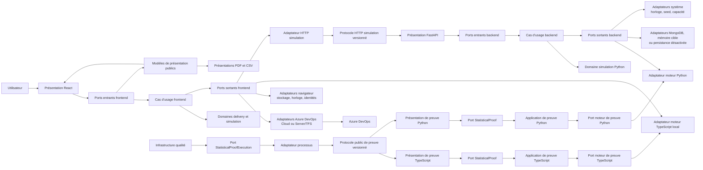
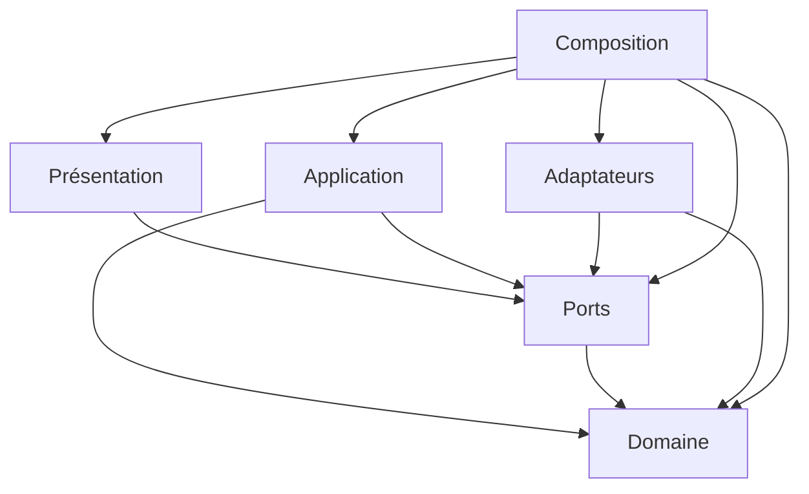
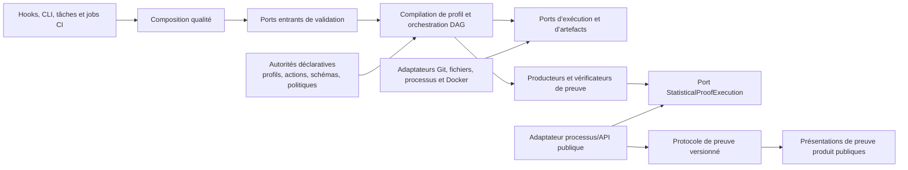

# Décision d’architecture — Architecture cible et frontières acceptées

## Statut, autorité et portée

- **Statut :** acceptée
- **Date :** 20 août 2026
- **Autorité :** ce document fixe l’architecture cible unique du produit, les frontières physiques et
  logiques attendues, la propriété des responsabilités, les ports nécessaires, les contrats entre runtimes et
  les règles de composition.

Cette décision instancie sans la modifier la
[matrice des directions de dépendance](target-dependency-directions.md). Le
[graphe factuel](dependency-graph.md) reste l’autorité de l’existant, le
[registre des données structurantes](structured-data-authority-registry.md) reste l’autorité de leurs
propriétaires exécutés actuels et la [baseline du coût de changement](change-cost-baseline.md) reste
l’autorité de la mesure avant migration. Une autorité cible décrite ici ne remplace donc jamais une autorité
actuelle avant la migration atomique de ses producteurs et consommateurs.

[`ARCHITECTURE.md`](../ARCHITECTURE.md) décrit l’architecture opérationnelle exécutée et les invariants de
sécurité actuels. Il ne constitue pas une seconde cible et reste factuel jusqu’à ce que chaque migration
publiée y reporte le nouvel état exécuté.

Les racines, couches et familles de frontières acceptées sont projetées dans
l’[autorité machine versionnée](../config/dependency-authority-v1.0.json). Cette projection lie la présente
décision et son empreinte, tandis que son [format documenté](dependency-authority.md) interdit de la faire
évoluer indépendamment des décisions 7.7/7.8. Elle rend la cible parsable sans créer une seconde architecture.

La décision couvre le navigateur TypeScript, le backend Python et l’infrastructure qualité. Elle ne déplace
aucun fichier, n’implémente aucun port, ne modifie aucun flux fonctionnel et ne décide pas l’ordre des
migrations. Une relation qui ne peut pas respecter cette cible exige une décision d’architecture qui amende
ou remplace explicitement le présent document ; aucun import de type, alias, fichier partagé ou allowlist ne
constitue une exception.

## Fondements factuels et critères d’acceptation

La cible répond aux constats vérifiés suivants :

- les cartes [frontend](frontend-responsibilities-map.md),
  [backend](backend-responsibilities-map.md) et
  [qualité](quality-infrastructure-responsibilities-map.md) localisent des responsabilités de domaine,
  d’application, de transport, de stockage, de présentation, de composition et de preuve actuellement
  mêlées ;
- le graphe réel contient 246 modules et 1 293 arêtes, dont 92 dépendances de compilation : 85 internes au
  frontend et 7 externes. Il expose deux cycles frontend impliquant des imports de type, aucun cycle runtime
  pur, 119 imports profonds, deux contournements conventionnels et huit arêtes de la qualité vers des modules
  produit ;
- aucune arête source ne relie directement le frontend au backend. Leur couplage réel passe par HTTP et les
  données, relation que le graphe d’import ne peut pas représenter et que cette décision rend explicite ;
- les deux cycles traversent `simulationForecastCore.ts`, qui est aussi le seul fichier commun à deux des
  trois scénarios de coût de changement. Les cartes de responsabilités expliquent les cumuls de ce module,
  d’`adoClient.ts`, de `useSimulation.ts` et de `quality_gate.py` ; la baseline confirme leurs signaux de
  couplage, taille ou traversée répétée ;
- les 23 données structurantes possèdent 23 autorités actuelles uniques, avec 14 familles d’ambiguïtés à
  résorber sans créer de seconde autorité.

### Mesures de référence conservées

| Scénario | Fichiers | Production | Tests | Lignes | Couches | Arêtes internes | Arêtes de frontière | Hotspots |
| --- | ---: | ---: | ---: | ---: | ---: | ---: | ---: | ---: |
| Contrat statistique | 21 | 13 | 8 | 5 996 | 9 | 27 | 73 | 3 |
| Collecte et calendrier delivery | 11 | 7 | 4 | 2 698 | 4 | 8 | 59 | 3 |
| Profil de validation `main` | 9 | 6 | 2 | 7 268 | 3 | 7 | 13 | 1 |

### Hotspots et contournements à dissoudre par les frontières

| Surface actuelle | Signal factuel | Responsabilité cible | Frontière qui localise le changement |
| --- | --- | --- | --- |
| `simulationForecastCore.ts` | 2 scénarios, degré 14, 255 lignes | Application `team-forecast` sans choix technique | `TeamForecast` + `SimulationEngine` + composition |
| `useSimulation.ts` | degré 18, 492 lignes | Présentation React et cas d’usage distincts | Ports entrants étroits, `simulation-history` et `preferences` |
| `frontend/src/domain/simulationValueObjects.ts` | degré 17, 394 lignes | Domaine simulation par agrégats cohésifs | API publique du domaine et valeurs minimales dans les ports |
| `backend/simulation_value_objects.py` | degré 12, 429 lignes | Domaine simulation par agrégats cohésifs | API publique du domaine et port moteur sans NumPy |
| `adoClient.ts` | degré 9, 681 lignes | Adaptateurs Cloud/Server séparés par capacité | Ports connexion, taxonomie, requête, work items et révisions |
| `Scripts/quality_gate.py` | degré 6, 1 637 lignes | Présentation/composition qualité mince | `QualityRun` + ports Git, snapshot, processus, conteneur et artefacts |

`frontend/src/domain/simulation.ts` (degré 26) et `frontend/src/types.ts` (degré 20) sont aussi des hubs du
graphe, sans être des hotspots confirmés par la règle à deux signaux. La cible interdit de les recréer sous
forme d’une façade monolithique ou d’un module `common`.

| Écart actuel | Destination cible |
| --- | --- |
| CYC-001 `demoData → usePortfolioReport → service → core → demoData` | Adaptateurs démo par capacité → ports ; application portefeuille → port moteur ; aucun type possédé par un hook |
| CYC-002 `core ↔ service` | Contrats `TeamForecast` et `SimulationEngine` possédés vers l’intérieur, dépendances unidirectionnelles |
| `core → api/simulationMappers` | Application → `SimulationEngine` ; mapper privé de l’adaptateur HTTP |
| `useSimulationHistory → storage/simulationHistoryMappers` | Application `simulation-history` → port de store ; mapper privé de l’adaptateur `localStorage` |

La cible est acceptée parce qu’elle satisfait simultanément les conditions suivantes :

1. chaque responsabilité possède une seule couche et un seul module propriétaire ;
2. chaque dépendance de code respecte exactement la direction déjà décidée, y compris pour les types et les
   chargements dynamiques ;
3. les runtimes échangent seulement par des protocoles versionnés et des mappers situés à leurs frontières ;
4. les choix Cloud/Server, local/HTTP, mémoire/MongoDB, navigateur/système et local/CI appartiennent
   exclusivement à des composition roots ;
5. les trois scénarios de référence deviennent des changements localisables et permettent des chantiers
   parallèles contre des contrats stables ;
6. le produit ne dépend jamais de l’infrastructure qualité, qui exerce uniquement des API, protocoles,
   points d’entrée et artefacts publics ;
7. aucune formule, borne, preuve ou garantie statistique n’est redéfinie.

## Vocabulaire des frontières

Un **module cible** est une unité cohésive ayant une seule raison principale de changer et une API publique.
Son intérieur est privé. En TypeScript, un module expose un point d’entrée public au niveau de sa racine ; en
Python, le package expose sa surface par son `__init__.py` ou par un module public explicitement nommé. Un
consommateur n’importe jamais un fichier interne de ce module.

Un **port entrant** est le contrat par lequel une présentation appelle un cas d’usage. Un **port sortant**
exprime une capacité demandée par l’application. Le besoin intérieur possède le port ; l’adaptateur ne le
possède pas. Les commandes, résultats et erreurs d’un port utilisent uniquement ses propres valeurs de
contrat et les valeurs de domaine publiques nécessaires.

Un **contrat inter-runtime** est une autorité versionnée de transport ou de preuve. Il ne s’agit ni d’un
modèle de domaine partagé entre langages ni de l’API interne d’un runtime. Chaque côté possède son DTO privé
et un mapper explicite vers ses valeurs intérieures.

## Vue 1 — Contexte d’exécution cible

Les flèches de cette vue représentent des appels et des données, pas des dépendances de code.



Le navigateur conserve la connexion Azure DevOps et le PAT. Son cookie pseudonyme est envoyé à chaque appel
HTTP avec les credentials ; le backend n’utilise sa valeur opaque pour persister que si elle est non vide et
si le repository est activé. Les présentations de rapport reçoivent des modèles structurés ; elles ne
relisent pas le DOM pour retrouver une donnée métier.

## Vue 2 — Direction du code dans chaque runtime produit

Cette vue est une projection de la décision normative existante. Elle n’introduit aucune relation
supplémentaire.



Les seules dépendances directes acceptées sont donc : domaine vers son propre domaine interne ; application
vers domaine et ports ; ports vers domaine ; adaptateurs vers domaine et ports ; présentation vers ports ;
composition vers toutes les couches. Les relations internes à une couche restent acycliques. Toute autre
flèche est interdite.

## Frontières physiques et responsabilités frontend

Les chemins ci-dessous sont les racines physiques cibles. Ils sont introduits progressivement ; leur absence
actuelle ne crée pas de solution alternative.

| Racine cible | Couche | Responsabilité exclusive | API publique attendue | Interdictions locales |
| --- | --- | --- | --- | --- |
| `frontend/src/domain/delivery/` | Domaine | Événement delivery normalisé, fenêtre historique, semaine et fuseau métier, périodes partielles, throughput, Cycle Time et diagnostics de qualité des données | Valeurs et politiques pures de delivery | Azure DevOps, React, stockage, HTTP, horloge globale et types de hook |
| `frontend/src/domain/simulation/` | Domaine | Commandes, Value Objects, résultats, histogrammes, Risk Score, fiabilité, scénarios portefeuille et politique de tirage | Valeurs statistiques et contrat algorithmique de tirage | React, DTO HTTP/stockage, navigateur et choix de moteur |
| `frontend/src/application/onboarding/` | Application | Session d’onboarding, enchaînement connexion/découverte et résultats applicatifs | Port entrant `Onboarding` | PAT sérialisé, appel HTTP direct et état visuel React |
| `frontend/src/application/team-history/` | Application | Acquisition d’un historique d’équipe, transformation par le domaine delivery et conservation des diagnostics | Port entrant `TeamHistory` | WIQL, DTO Azure DevOps et présentation des avertissements |
| `frontend/src/application/team-forecast/` | Application | Orchestration d’une prévision d’équipe à partir d’un historique et d’un moteur | Port entrant `TeamForecast` | Choix HTTP/local, React, DOM et DTO techniques |
| `frontend/src/application/portfolio-forecast/` | Application | Orchestration des équipes, scénarios et progression portefeuille | Port entrant `PortfolioForecast` | Hook React, téléchargement et adaptateur de rapport |
| `frontend/src/application/simulation-history/` | Application | Politique de création, limite, séparation démo/connecté, réutilisation et cycle de sauvegarde des historiques locaux | Port entrant `SimulationHistory` | `localStorage`, DTO versionné et dépendance React |
| `frontend/src/application/preferences/` | Application | Valeurs, fallbacks et validation des préférences et raccourcis de simulation/portefeuille | Port entrant `Preferences` | Clés `localStorage`, sérialisation et thème visuel |
| `frontend/src/application/theme-preferences/` | Application | Politique best effort de lecture et sauvegarde du thème visuel | Port entrant `ThemePreferences` | React, clés `localStorage` et accès navigateur direct |
| `frontend/src/application/client-session/` | Application | Assurer une identité cliente pseudonyme sans connaître cookie ni UUID | Port entrant `ClientSession` | API navigateur et métadonnée HTTP |
| `frontend/src/application/statistical-proof/` | Application | Exposer l’exécution canonique et le batching nécessaires au protocole de preuve | Port entrant `StatisticalProof`, port sortant `StatisticalProofEngine` | React, Azure DevOps, stockage et runner qualité |
| `frontend/src/ports/<capacité>/` | Ports | Un contrat entrant ou sortant par capacité, possédé par le cas d’usage intérieur nommé dans le catalogue ci-dessous | Commandes, résultats et erreurs minimaux | Framework, DTO technique, concrétions et module `common` sans propriétaire |
| `frontend/src/adapters/azure-devops/{cloud,server}/` | Adaptateurs | PAT, transport, connexion, découverte, WIQL, lots de work items, révisions et conversion en valeurs intérieures | Implémentations des ports Azure DevOps | Import de l’autre plateforme, calcul delivery et type de présentation |
| `frontend/src/adapters/simulation/{local,http}/` | Adaptateurs | Exécution TypeScript locale, exécution de preuve avec batching ou traduction vers le protocole HTTP | Vues conformes aux ports moteur de production ou de preuve ; un même concret local peut implémenter les deux sans les fusionner | Choix de l’adaptateur, hook React et fuite de DTO |
| `frontend/src/adapters/browser/{storage,theme-storage,clock,seed,history-id,client-id}/` | Adaptateurs | Une API navigateur par capacité : `localStorage`, thème, horloge, entropie, UUID ou cookie | Une implémentation par port, sans façade agrégée | Imports croisés, orchestration, règle métier et dépendance vers React |
| `frontend/src/adapters/demo/{discovery,delivery,simulation}/` | Adaptateurs | Données contrôlées conformes aux mêmes ports que les sources réelles | Une implémentation indépendante par capacité | Import entre adaptateurs, type possédé par un hook et branche démo dans un cas d’usage |
| `frontend/src/presentation/models/` | Présentation | Modèles équipe/portefeuille, mappers fidèles, contrats de rendu/export et traduction visuelle du thème | Modèles et requêtes de restitution prêts à rendre | Recalcul métier ou statistique et DTO d’adaptateur |
| `frontend/src/presentation/react/` | Présentation | État visuel, interactions, navigation et rendu React | Composants recevant des ports entrants et modèles étroits | Domaine direct, service concret, stockage et moteur |
| `frontend/src/presentation/reports/{pdf,csv}/` | Présentation | Rendu et téléchargement depuis des modèles structurés | Implémentations indépendantes des contrats de restitution | Dépendance entre PDF et CSV, lecture métier du DOM et recalcul |
| `frontend/src/presentation/proof/` | Présentation | Mapper le protocole JSON de preuve vers `StatisticalProof` et son résultat canonique | Entrée publique de preuve indépendante de React | Import d’un moteur ou orchestration statistique |
| `frontend/src/composition/{browser,proof,instrumentation}/` | Composition | Choix du mode, construction des adaptateurs, cas d’usage et présentations ; compositions publiques séparées pour preuve et instrumentation E2E | Factory retournant seulement ports ou surfaces publiques dédiées | Règle métier, transformation, service locator et export de concrétions |

`SampleIndexDrawPort` reste un contrat algorithmique du domaine simulation malgré son nom historique. Il ne
devient pas un port applicatif et conserve exactement sa politique de tirage et de batching.

Le domaine delivery construit une seule fois complétude, discontinuités, cohérence chronologique, throughput
et Cycle Time. Le domaine simulation construit une seule fois probabilités, légendes de risque, fiabilité et
diagnostics décisionnels équipe/portefeuille lorsque ces valeurs portent une signification métier.
L’application les conserve sans perte ; la présentation possède seulement formulation, format, disposition,
coordonnées de graphique et lissages purement visuels. Un composant ou un rapport ne reconstruit jamais un
diagnostic déjà présent dans le résultat.

React reçoit par composition les contrats publics de restitution. Il peut demander un PDF ou un CSV à partir
d’un modèle structuré, sans importer le renderer concret ; chaque renderer possède son téléchargement et ne
dépend ni de React ni de l’autre restitution. React traduit visuellement le thème mais appelle
`ThemePreferences` pour sa persistance best effort ; l’application dédiée dépend de `ThemePreferencesStore`,
jamais de l’adaptateur navigateur.

Les adaptateurs Azure DevOps possèdent transport, découpage technique des lots et remontée d’un succès ou
échec typé par lot/révision, sans retry implicite. `team-history` possède la décision de poursuivre ou d’abandonner,
la fusion des avertissements et le résultat partiel. `portfolio-forecast` possède parallélisme entre équipes,
tolérance aux équipes en échec, agrégation des avertissements et résultat portefeuille partiel. Ces politiques
ne sont ni cachées dans l’adaptateur ni reconstruites dans React.

## Frontières physiques et responsabilités backend

| Racine cible | Couche | Responsabilité exclusive | API publique attendue | Interdictions locales |
| --- | --- | --- | --- | --- |
| `backend/domain/simulation/` | Domaine | Sémantique, commandes, Value Objects, invariants, politiques et dérivations de percentiles, censure, Risk Score, fiabilité, histogramme et complétion | Valeurs et politiques statistiques sans type technique public | FastAPI, Pydantic, PyMongo, Redis, HTTP et NumPy exposé dans l’API publique |
| `backend/domain/history/` | Domaine | Identité et représentation métier minimales d’une entrée d’historique | Valeurs d’historique indépendantes du stockage | Document Mongo, cookie HTTP et politique de route |
| `backend/application/simulation/` | Application | Orchestration de seed, décision de limitation observable, exécution et résultat du cas d’usage de simulation | Port entrant `Simulate` | Threadpool HTTP, store concret, global d’import et DTO Pydantic |
| `backend/application/history/` | Application | Sauvegarde best effort, lecture minimisée et diagnostic de disponibilité du repository | Ports entrants `RecordSimulation`, `ListSimulationHistory`, `CheckHistoryStoreHealth` | PyMongo, projection BSON et cookie brut |
| `backend/application/operations/` | Application | Scrub d’identité en dry-run/apply et purge par client inactif, sans ordonnanceur implicite | Ports entrants `ScrubSimulationIdentity` et `PurgeInactiveClients` | Client Mongo, variables d’environnement directes et quality gate |
| `backend/application/statistical-proof/` | Application | Exposer l’exécution canonique et la taille de batch nécessaires au protocole de preuve | Port entrant `StatisticalProof`, port sortant moteur de preuve | FastAPI, MongoDB et import du runner qualité |
| `backend/ports/<capacité>/` | Ports | Contrats entrants et sortants propres aux besoins backend | Commandes, résultats et erreurs minimaux | NumPy, Pydantic, PyMongo, Redis, FastAPI et concrétions |
| `backend/adapters/engine/{numpy,mca-prng}/` | Adaptateurs | Exécution numérique privée, batching de preuve et adaptation du PRNG contractuel aux contrats du domaine | Vues conformes aux ports moteur de production ou de preuve et au contrat de tirage, sans type NumPy à la frontière | Transport HTTP, persistance, seconde autorité statistique et choix de composition |
| `backend/adapters/persistence/{mongodb,memory,disabled}/` | Adaptateurs | Documents, projections, connexions, index et mappage du repository ; mémoire seulement en composition explicite, désactivé pour préserver l’absence de store | Implémentations indépendantes du même port de persistance | Import mutuel, DTO HTTP et règle métier statistique |
| `backend/adapters/system/{clock,seed,rate-limit}/` | Adaptateurs | Horloge UTC, seed cryptographique et stockage de limitation mémoire/Redis | Une implémentation par port technique, sans façade agrégée | Import croisé, cas d’usage, route et configuration globale cachée |
| `backend/presentation/http/` | Présentation | FastAPI, Pydantic, CORS, codes HTTP, timeout d’attente, cookie et mappers du protocole | Routes dépendant uniquement des ports entrants | Store, moteur, MongoDB, NumPy et construction d’un cas d’usage |
| `backend/presentation/proof/` | Présentation | Mapper le protocole JSON de preuve vers `StatisticalProof` et son résultat canonique | Entrée publique de preuve indépendante de FastAPI | Import d’un moteur ou orchestration statistique |
| `backend/presentation/static/` | Présentation | Exposition facultative du bundle frontend compilé | Point d’entrée de fichiers statiques | Import de sources frontend et orchestration métier |
| `backend/composition/{api,proof,operations}/` | Composition | Lecture de configuration, durées de vie, câblage API, preuve statistique et commandes opératoires | Factories retournant ports ou application assemblée | Objet global construit à l’import, règle métier et contournement d’un port |

Le timeout HTTP continue de borner l’attente sans prétendre annuler le thread de calcul. Un calcul qui finit
après le timeout ne produit ni réponse ni persistance. Après un résultat obtenu dans le délai, la présentation
HTTP utilise son mécanisme request-scoped `BackgroundTasks` pour appeler `RecordSimulation` avec l’identité
optionnelle ; elle ne construit aucun adaptateur. L’application history ne sauvegarde rien si cette identité
est vide ou si le repository est désactivé. Une écriture échouée reste journalisée en best effort et ne
modifie ni le résultat statistique ni la réponse HTTP déjà produite.

L’adaptateur MongoDB conserve connexion/fermeture au lifespan, index `(mc_client_id, created_at desc)`, TTL
glissant sur `last_seen`, projection minimisée, retrait des champs sensibles, ping et unique retry après
`PyMongoError`. Une politique de rétention cible unique porte deux paramètres nommés : `historyTtlDays=30`,
fixe comme aujourd’hui, et `inactiveClientPurgeDays`, toujours configurable par `APP_PURGE_RETENTION_DAYS`
avec 30 par défaut. Les deux valeurs sont injectées aux adaptateurs concernés sans les confondre. L’adaptateur
mémoire est une cible explicite pour les compositions locales qui le demandent, jamais un fallback silencieux
de MongoDB.

Les commandes de scrub et de purge sont des entrées opératoires avec leur propre composition root. Le scrub
reste en dry-run par défaut ; la purge reste par client et aucun ordonnanceur automatique n’est ajouté. Elles
passent par des ports administratifs et un port repository dédié sans devenir des composants de la quality
gate ni importer l’adaptateur MongoDB de l’API.

## Frontière propre de l’infrastructure qualité

L’infrastructure qualité est un système de preuve extérieur au graphe produit. Sa structure cible utilise
les racines suivantes sous `Scripts/quality/` ; les entrypoints historiques sous `Scripts/` deviennent à
terme de minces présentations CLI vers ces modules.

Les flèches de la vue suivante représentent les appels et données. Pour le code, l’application et les
adaptateurs dépendent tous deux des ports qualité ; ils ne dépendent jamais de leurs implémentations
respectives.



| Racine ou autorité cible | Responsabilité exclusive | Règle durable |
| --- | --- | --- |
| `config/test-execution-profiles.json` et son schéma | Autorité de valeurs des profils, nœuds, dépendances, ressources et artefacts | Le schéma possède la forme ; l’instance possède les valeurs, sans commandes cachées |
| Catalogue cible des actions d’exécution sous `config/` | Autorité unique des identifiants, paramètres et commandes/actions exécutables | Le smoke Docker et le verdict consolidé deviennent des actions explicites du plan fermé |
| `config/product-inspection-surfaces.json` et son schéma | Autorité des source sets, artefacts, exclusions et usages permis aux inspections statiques | Aucun chemin produit concret n’est caché dans un producteur ou un orchestrateur |
| `Scripts/quality/contracts/` | Modèles de plan, résultats de nœuds et artefacts qualité | Aucun chemin produit concret ni mécanisme d’exécution |
| `Scripts/quality/application/` | Modules séparés de sélection, inspection, isolation, compilation, exécution du DAG, promotion, agrégation et verdict | Chaque module a une seule responsabilité et dépend seulement des contrats et ports qualité |
| `Scripts/quality/ports/` | Change set Git, snapshot, lecture de sources, processus, conteneur, horloge et dépôt d’artefacts | Un contrat par capacité, sans API de bibliothèque concrète |
| `Scripts/quality/adapters/` | Git, système de fichiers, subprocess, Docker et runners Pytest/Vitest/Playwright | Aucun import d’adaptateur produit interne et aucun workflow CI déplacé dans Python |
| `Scripts/quality/evidence/` | Producteurs, vérificateurs et modèles de preuve indépendants | Une preuve fraîche est distincte d’une référence versionnée ; le vérificateur ne dépend pas du producteur concret |
| `Scripts/quality/composition/` | Assemblage des modes `fast`, `push`, `ci`, `nightly`, `release` et des nœuds CI | Le point d’entrée choisit les adaptateurs et remet seulement des ports à l’orchestrateur |
| `.github/workflows/ci.yml` | Présentation/projection CI du plan autoritaire | Les jobs, transferts et installations sont vérifiés contre le plan ; ils n’en redéfinissent pas le DAG |

Le produit n’importe aucun de ces modules. Pour une preuve dynamique, la qualité peut lancer un point d’entrée
public, exercer une API publique ou lire un artefact contractuel ; elle ne peut pas importer un adaptateur
backend, un hook frontend ou un fichier interne de moteur. Une inspection statique de maintenabilité,
d’identité, de Vitals, de couverture ou de sélection adaptative peut lire les sources comme données via les
source sets déclarés et `ProductSourceReader` ; elle ne les importe ni ne les exécute comme API. Un test
possédé par le module d’un adaptateur peut exercer ses internes dans la frontière de ce module ; les
orchestrateurs et runners transversaux utilisent une API publique ou cette surface d’inspection déclarée.

### Propriété des familles qualité

| Famille actuelle | Module cible propriétaire |
| --- | --- |
| Change policy et sélection adaptative | `quality/application/change-selection` |
| Topologie et snapshots de sources inspectables | `quality/application/product-inspection` |
| Classification et inventaire de tests | `quality/application/test-classification` |
| Profils, validation et compilation de plan | `quality/application/profile-compilation` |
| Ordonnancement, concurrence et ressources | `quality/application/dag` |
| Résultats natifs et dénombrement logique | `quality/evidence/execution-counts` |
| Couvertures Python, Vitest, E2E et Vitals | Producteurs/vérificateurs distincts sous `quality/evidence/coverage` |
| Gouvernance, stratégie et maintenabilité | Modules indépendants sous `quality/evidence/` |
| Hygiène, backlog, identité et nommage | Contrôles indépendants sous `quality/evidence/preflight` |
| Preuves statistiques et compatibilité | Producteurs/vérificateurs sous `quality/evidence/statistical` via `StatisticalProofExecution` |
| Promotion, agrégation et verdict | `quality/application/aggregate` |

Les isolations restent contractuelles : le pré-commit exerce un snapshot de l’index ; le pré-push chaque SHA
terminale dans un worktree détaché ; le `main` local un snapshot des fichiers suivis et non suivis non ignorés ;
la CI un checkout par job avec transfert d’artefacts. MongoDB, les ports `8000`/`4173` et le projet Compose sur
`18080` restent des ressources exclusives, et deux nœuds parallèles ne partagent ni ressource exclusive ni
chemin d’artefact.

## Catalogue des ports frontend attendus

Les noms ci-dessous sont les identifiants architecturaux acceptés. Les signatures détaillées appartiennent
aux migrations locales ; elles ne peuvent pas élargir la responsabilité décrite.

| Port | Sens et propriétaire | Capacité minimale | Implémentations ou consommateurs attendus |
| --- | --- | --- | --- |
| `Onboarding` | Entrant, application onboarding | Ouvrir une session opaque, découvrir les sélections et produire les transitions applicatives | Présentation React consommatrice |
| `TeamHistory` | Entrant, application team-history | Construire un historique delivery avec diagnostics, sans DTO Azure DevOps | Prévision équipe et présentation consommatrices |
| `TeamForecast` | Entrant, application team-forecast | Prévoir une équipe depuis un historique et retourner un résultat applicatif complet | React et portefeuille consommateurs |
| `PortfolioForecast` | Entrant, application portfolio-forecast | Prévoir plusieurs équipes/scénarios et publier une progression contractuelle | React consommateur |
| `SimulationHistory` | Entrant, application simulation-history | Charger, enregistrer et sélectionner un historique réutilisable selon une politique unique | React et `TeamForecast` consommateurs |
| `Preferences` | Entrant, application preferences | Charger/valider/enregistrer préférences et raccourcis par contexte | React consommateur |
| `ThemePreferences` | Entrant, application theme-preferences | Charger et enregistrer le thème avec fallback et échec absorbé | Présentation React consommatrice |
| `ClientSession` | Entrant, application client-session | Assurer l’identité pseudonyme avant un transport authentifié par cookie | Présentation React au bootstrap |
| `StatisticalProof` | Entrant, application statistical-proof | Exécuter commande canonique et paramètres de batching du protocole public | Présentation de preuve TypeScript |
| `AzureDevOpsConnection` | Sortant, onboarding | Établir ou invalider un contexte d’authentification opaque sans exposer le PAT | Adaptateurs Cloud et Server/TFS |
| `AzureDevOpsDiscovery` | Sortant, onboarding | Lister organisations/collections, projets et équipes avec erreurs intérieures | Adaptateurs Cloud, Server/TFS et démo |
| `DeliveryTaxonomy` | Sortant, team-history | Lire types de tickets et états avec résultat intérieur stable | Adaptateurs Cloud, Server/TFS et démo |
| `DeliveryQuery` | Sortant, team-history | Exprimer la sélection delivery sans construire le transport WIQL | Adaptateurs Cloud et Server/TFS |
| `WorkItemReader` | Sortant, team-history | Lire les faits utiles de work items sans type SDK | Adaptateurs Cloud et Server/TFS |
| `RevisionReader` | Sortant, team-history | Lire séparément les faits temporels de révisions | Adaptateurs Cloud et Server/TFS |
| `SimulationEngine` | Sortant, team-forecast | Exécuter une commande de domaine et retourner un résultat de domaine | Adaptateurs TypeScript local et HTTP |
| `StatisticalProofEngine` | Sortant, statistical-proof | Exécuter le même cœur et PRNG avec les paramètres de batching exigés par la preuve | Vue de l’adaptateur TypeScript local ; aucun import de l’adaptateur de production |
| `SimulationHistoryStore` | Sortant, simulation-history | Charger et sauvegarder les historiques locaux par valeurs intérieures | Adaptateur `localStorage` avec DTO et migrations privés |
| `UserPreferencesStore` | Sortant, preferences | Charger et sauvegarder préférences et raccourcis contextualisés | Adaptateur `localStorage` |
| `ThemePreferencesStore` | Sortant, theme-preferences | Charger et sauvegarder la valeur de thème sans exposer clé ni API navigateur | Adaptateur `localStorage` dédié |
| `FrontendClock` | Sortant, team-forecast | Fournir l’instant d’une exécution et de son historique | Adaptateur navigateur et double déterministe |
| `FrontendSimulationSeedSource` | Sortant, team-forecast | Résoudre une seed uint32 exactement une fois par prévision | Adaptateur d’entropie navigateur et double déterministe |
| `HistoryIdGenerator` | Sortant, simulation-history | Produire une identité opaque d’historique | Adaptateur UUID navigateur et double déterministe |
| `ClientIdentity` | Sortant, client-session | Lire, renouveler et conserver l’identité pseudonyme sans exposer cookie ni UUID au consommateur | Adaptateur cookie navigateur |

La progression portefeuille est une valeur du contrat `PortfolioForecast`, pas un état possédé par React.
Les modèles de présentation équipe et portefeuille forment une API publique de présentation, pas un port
sortant de l’application. PDF et CSV consomment cette API sans dépendre l’un de l’autre.

La composition construit les implémentations Cloud et Server/TFS puis injecte une table fermée de ports
indexée par la valeur intérieure de cible. L’application choisit une entrée de cette table sans importer de
concrétion ; aucun adaptateur ne délègue à l’autre. Les stores `localStorage` absorbent leurs erreurs, gardent
DTO, versions et migrations privés ; l’application possède limites, séparation démo/connecté, fallbacks,
validation des raccourcis et politique de réutilisation.

## Catalogue des ports backend attendus

| Port | Sens et propriétaire | Capacité minimale | Implémentations ou consommateurs attendus |
| --- | --- | --- | --- |
| `Simulate` | Entrant, application simulation | Valider la commande intérieure, obtenir une seed unique, appliquer la règle de limitation et produire un résultat | Présentation HTTP |
| `RecordSimulation` | Entrant, application history | Effectuer une sauvegarde best effort d’un résultat déjà calculé avec identité optionnelle | Présentation HTTP, planifiée après succès dans le délai |
| `ListSimulationHistory` | Entrant, application history | Retourner une vue minimisée sans identité ni document technique | Présentation HTTP |
| `CheckHistoryStoreHealth` | Entrant, application history | Retourner `disabled`, `ok` ou une indisponibilité sans exposer le store | Présentation HTTP `/health/mongo` |
| `ScrubSimulationIdentity` | Entrant, application operations | Compter ou retirer les champs legacy, dry-run par défaut | Présentation CLI opératoire |
| `PurgeInactiveClients` | Entrant, application operations | Purger par client selon la politique de rétention et produire un compte rendu | Présentation CLI opératoire |
| `StatisticalProof` | Entrant, application statistical-proof | Exécuter commande canonique et paramètres de batching du protocole public | Présentation de preuve Python |
| `PythonSimulationEngine` | Sortant, application simulation | Exécuter la commande et retourner le résultat sans type NumPy dans le contrat | Adaptateur moteur Python |
| `PythonStatisticalProofEngine` | Sortant, application statistical-proof | Exécuter le même cœur et PRNG avec le batching contractuel sans type NumPy public | Vue de l’adaptateur moteur Python distincte du port de production |
| `SimulationRepository` | Sortant, application history | Sauvegarder, lister et vérifier la disponibilité par valeurs intérieures | Adaptateurs MongoDB, mémoire explicite et désactivé |
| `SimulationRepositoryAdmin` | Sortant, application operations | Scrubber et purger sans document Mongo dans le contrat | Adaptateur administratif MongoDB |
| `BackendClock` | Sortant, application history | Fournir un instant UTC contrôlable | Adaptateur système et double déterministe |
| `SimulationSeedSource` | Sortant, application simulation | Résoudre une seed uint32 exactement une fois si elle est absente | Adaptateur cryptographique et double déterministe |
| `SimulationRateLimiter` | Sortant, application simulation | Décider et diagnostiquer l’admission depuis une clé opaque, sans code HTTP | Adaptateurs mémoire/Redis conservant quota, compteur et fail-open actuels |

L’identité cliente backend est une valeur minimale d’entrée du port `RecordSimulation` et du filtre de
`ListSimulationHistory`. La présentation HTTP convertit le cookie en cette valeur opaque ; l’application ne
connaît ni le nom du cookie ni son format navigateur.

`SimulationRetentionPolicy` est une valeur publique unique du domaine history, pas un port. Les applications
history et operations en dépendent ; les compositions injectent son paramètre TTL fixe et son paramètre de
purge configurable aux adaptateurs correspondants. Aucune valeur n’est implicitement copiée de l’une à l’autre.

La présentation HTTP dérive la clé de limitation de la première valeur `X-Forwarded-For`, sinon de l’adresse
cliente, sinon de `unknown`, puis la fournit au port `Simulate`. L’application ne connaît pas les headers ;
l’adaptateur de limitation conserve le stockage mémoire/Redis, le diagnostic de disponibilité et le fail-open
actuel lorsque Redis est indisponible. La présentation traduit seulement le refus intérieur en `429`.

## Ports et protocoles attendus pour la qualité

| Contrat | Propriétaire | Responsabilité |
| --- | --- | --- |
| `QualityRun` | `quality/application/run` | Compiler un profil autoritaire, exécuter son DAG et produire un verdict agrégé |
| `ProfileCompiler` | `quality/application/profile-compilation` | Transformer le contrat déclaré en plan fermé et diagnostiqué sans l’exécuter |
| `ChangeSet` | `quality/application/change-selection` | Lire le changement Git sans dépendre d’une commande concrète |
| `WorkspaceSnapshot` | `quality/application/workspace-isolation` | Matérialiser l’état exact propre au mode sans connaître le système de fichiers concret |
| `ProcessExecutor`, `ContainerRuntime` | `quality/application/dag-execution` | Exécuter une action du plan via processus ou conteneur sans en redéfinir la commande |
| `ArtifactRepository` | `quality/application/artifact-promotion` | Publier, promouvoir et relire des artefacts identifiés par profil/nœud/snapshot |
| `ProductSourceReader` | `quality/application/product-inspection` | Lire comme données les seuls source sets autorisés par le manifeste d’inspection |
| `StatisticalProofExecution` | `quality/evidence/statistical` | Invoquer le protocole public de preuve sans import produit interne |
| `EvidenceProducer` | Module `quality/evidence/<famille>` concerné | Produire un rapport contractuel depuis des résultats frais |
| `EvidenceVerifier` | Module vérificateur distinct de la même famille | Vérifier schéma, sources, empreintes, fraîcheur et verdict sans appeler le producteur concret |

Chaque runtime produit expose une présentation publique de preuve qui mappe le protocole versionné puis
appelle le port entrant `StatisticalProof`, distinct de `Simulate`. L’application accepte la commande
normalisée et les paramètres de batching et dépend de son port sortant moteur de preuve. La composition ne
fait qu’assembler cette chaîne. L’adaptateur processus qualité implémente `StatisticalProofExecution` en
invoquant la présentation ; producteurs et vérificateurs consomment ensuite résultats et artefacts, jamais
l’implémentation produit.

Le port qualité interne `StatisticalProofExecution` et le protocole statistique JSON versionné sont deux
contrats distincts : l’adaptateur processus implémente le premier au moyen du second. Le protocole et ses
schémas sous `contracts/` restent la seule jonction entre
les deux runtimes, la production de preuve et sa vérification. Les autres familles qualité conservent leurs
formats propres de couverture, build, logs et Markdown. Un rapport versionné historique ne remplace jamais la
preuve fraîche du snapshot courant.

## Contrats frontend/backend et inter-runtime

### Protocole HTTP de simulation

Le frontend et le backend dépendent d’un contrat de transport versionné sous `contracts/`, jamais de leurs
implémentations respectives. L’autorité cible de forme doit conserver les propriétés observées suivantes :

- `POST /simulate` reçoit seulement les échantillons de throughput, le mode, son paramètre actif,
  `include_zero_weeks`, `n_sims` et la seed optionnelle ;
- aucun PAT, identifiant ou DTO Azure DevOps, date, type de ticket ou état ne traverse cette frontière ;
- l’identité cliente pseudonyme est une métadonnée HTTP opaque distincte de la commande statistique ;
- le protocole est fermé et versionné ; les DTO privés TypeScript et Python sont des projections fermées,
  confinées et validées contre cette version, sans politique de version indépendante ;
- chaque runtime mappe explicitement ces DTO vers sa commande et son résultat intérieurs ;
- les réponses conservent les percentiles, censures, complétion, Risk Score, fiabilité, histogramme, seed et
  effectifs requis par le contrat actuel ;
- les rejets d’entrée, limites et indisponibilités restent traduits explicitement en `422`, `429` et `503` ou
  en erreurs intérieures équivalentes ;
- une addition compatible peut faire évoluer la version mineure du contrat ; une rupture exige une nouvelle
  version et une décision de compatibilité. Une compatibilité structurelle TypeScript implicite est interdite.

L’adaptateur frontend HTTP implémente `SimulationEngine`. La présentation backend HTTP implémente le
protocole et appelle `Simulate`. Le backend appelle ensuite `PythonSimulationEngine`. Ces trois contrats ont
des propriétaires différents et ne sont jamais fusionnés dans un modèle partagé de runtime.

### Protocole HTTP d’historique et identité wire

Le même ensemble de contrats de transport versionnés est l’unique autorité de `GET /simulations/history` et
du nom wire de la métadonnée d’identité :

- le contrat possède `IDMontecarlo` comme nom actuel du cookie ; toute configuration de déploiement est une
  projection validée de cette valeur puis injectée aux deux runtimes, jamais une surcharge indépendante ;
- le navigateur conserve génération et renouvellement UUID v4, `SameSite=Strict`, chemin `/` et durée d’un
  an ; le backend traite toute chaîne non vide comme une clé opaque et n’ajoute pas de validation UUID ;
- le résultat d’historique est minimisé, ne contient ni identité, ni échantillons bruts, ni contexte Azure
  DevOps et projette les dates en UTC ISO ;
- un cookie absent/vide ou une persistance désactivée retourne `[]` ; une erreur MongoDB ou une ligne
  incompatible reste un `503` ;
- aucun consommateur frontend de production n’appelle actuellement cette route. Sa présence dans le contrat
  cible ne crée ni usage fonctionnel ni dépendance nouvelle.

La présentation HTTP mappe le DTO de cette version vers le résultat du port `ListSimulationHistory`. Le DTO
reste une projection de transport ; il n’est pas l’autorité du résultat applicatif intérieur.

### Contrat statistique interlangage

[`STD-STAT-001`](standards/STD-STAT-001.md) reste la seule autorité sémantique. Les domaines Python et
TypeScript sont deux implémentations indépendantes, contrôlées par le PRNG contractuel, le corpus, le rejeu
exact, la parité distributionnelle et la compatibilité. Aucun runtime n’importe le modèle intérieur de
l’autre.

Les présentations de preuve exposent une commande normalisée et un résultat canonique par le protocole de
preuve existant. Les runners qualité les invoquent comme processus ou API publique ; le runner Python
n’importe plus `mc_core`, le service ou les Value Objects internes, et les runners TypeScript n’importent plus
un adaptateur privé par chemin profond.

### Bundle frontend servi par le backend

Le bundle compilé est un artefact de déploiement. La présentation statique backend peut servir son répertoire
de sortie, mais le backend ne dépend d’aucune source, type ou module frontend. La construction et la copie de
l’artefact appartiennent à la composition de déploiement.

## Règles de composition et de durée de vie

La composition est le seul lieu autorisé à connaître simultanément une implémentation applicative, un
adaptateur concret et une présentation.

### Composition navigateur

1. résoudre le mode `standard`, `demo` ou `connect` et la configuration publique ;
2. pour les modes qui les utilisent, construire horloge, identités, stores de simulation/préférences/thème et
   les implémentations Cloud/Server remises sous forme de ports indexés par la cible intérieure ;
3. en mode standard, injecter l’adaptateur HTTP `SimulationEngine` ; en mode démo, injecter l’adaptateur
   TypeScript local ;
4. construire les cas d’usage avec leurs ports sortants ;
5. remettre seulement les ports entrants et modèles de présentation au shell React.

Le mode `connect` compose seulement la notice publique : aucun port Azure DevOps, cas d’usage de simulation ou
moteur n’est construit. Le mode démo remplace des adaptateurs, jamais une branche interne aux cas d’usage.
Aucun hook ne construit un client Azure DevOps, un moteur ou un store.

### Composition backend API

1. lire et valider la configuration une fois au démarrage ;
2. construire horloge, source de seed, limiteur, moteur et repository actif ou désactivé ;
3. construire les cas d’usage `Simulate`, `RecordSimulation`, `ListSimulationHistory` et
   `CheckHistoryStoreHealth` ;
4. injecter uniquement leurs ports entrants dans la présentation FastAPI ;
5. confier au lifespan la connexion et la fermeture des adaptateurs à durée de vie applicative.

Aucun objet concret n’est construit lors de l’import d’une route. Le PRNG reste propre à une exécution et son
état reste continu entre les batches de cette exécution. Le scheduling request-scoped de `RecordSimulation`
reste une mécanique de la présentation FastAPI et n’est donc pas construit comme singleton au démarrage.

### Compositions de preuve et opératoires

Les compositions de preuve Python et TypeScript assemblent la présentation publique et ses mappers, le port
entrant `StatisticalProof`, l’application de preuve, son port sortant moteur, l’adaptateur moteur et le port de
tirage, sans FastAPI, React, Azure DevOps, MongoDB ou stockage navigateur. La présentation appelle le port
entrant ; la composition ne consomme ni n’orchestre les internes du moteur. Les
compositions opératoires assemblent `ScrubSimulationIdentity` ou `PurgeInactiveClients`, leur politique de
rétention et leurs adaptateurs sans importer la composition API.

### Composition qualité

Les hooks Git, tâches locales et jobs CI sélectionnent un mode puis délèguent à une même composition qualité.
Le contrat de profils décide le DAG ; la composition choisit seulement les adaptateurs nécessaires au
contexte local ou CI. Elle ne réécrit ni dépendance de nœud, ni commande métier, ni verdict statistique.

## Propriétaires cibles des données structurantes

Le tableau suivant est une destination, pas un changement d’autorité déjà exécuté. Une migration conserve
l’autorité actuelle du registre jusqu’au basculement complet, puis met à jour le registre dans le même état
publiable. Une forme technique parallèle reste une représentation de frontière, jamais une seconde autorité.

| Donnée auditée | Propriétaire cible | Transformation de frontière attendue |
| --- | --- | --- |
| SD-01 runtime frontend | Composition navigateur | Environnement et URL vers une configuration publique remise par ports |
| SD-02 navigation | Présentation React | Actions visuelles vers état de navigation, sans autorité de cas d’usage |
| SD-03 session onboarding | Application onboarding | Saisies vers commande/session applicative ; PAT confiné dans la connexion opaque |
| SD-04 cible Azure DevOps | Application onboarding, via `AzureDevOpsConnection` | Configuration de composition vers valeur de contrat, puis DTO privé d’adaptateur |
| SD-05 entité découverte | Application onboarding, via `AzureDevOpsDiscovery` | DTO Cloud/Server vers entité intérieure par mapper explicite |
| SD-06 options équipe | Application team-history, via `DeliveryTaxonomy` | DTO types/états vers résultat intérieur validé une seule fois |
| SD-07 observations delivery | Domaine delivery | Faits techniques vers événements, semaines et Cycle Time métier |
| SD-08 sémantique statistique | `STD-STAT-001` | Aucune nouvelle autorité ; les runtimes restent des implémentations conformes |
| SD-09 commande/résultat TypeScript | Domaine simulation frontend | DTO HTTP, stockage ou preuve vers valeurs TypeScript par mappers de frontière |
| SD-10 contrat HTTP | Contrats inter-runtime simulation et historique versionnés | DTO privés frontend/backend et configuration du nom wire comme projections vers chaque runtime |
| SD-11 historique local intérieur | Application simulation-history | Résultats delivery/simulation vers entrée d’historique intérieure |
| SD-12 DTO historique local | Adaptateur stockage navigateur | Modèle intérieur vers DTO versionné et migration legacy privée |
| SD-13 préférences simulation | Application preferences | État accepté via `UserPreferencesStore` vers DTO privé `localStorage` |
| SD-14 filtres/portefeuille persistés | Application preferences | Valeurs contextualisées via `UserPreferencesStore` vers DTO privé et migration legacy |
| SD-15 configuration équipe portefeuille | Application portfolio-forecast | Saisie validée vers commande du port `PortfolioForecast` |
| SD-16 résultat scénario portefeuille | Application portfolio-forecast | Résultats de domaine vers résultat applicatif sans forme de rapport |
| SD-17 section de rapport portefeuille | Présentation modèles | Résultat applicatif vers modèle de présentation structuré |
| SD-18 diagnostic comparatif | Domaine simulation frontend | Faits et résultats vers diagnostic métier, puis libellés en présentation |
| SD-19 identité cliente navigateur | Application client-session | Port `ClientIdentity` vers cookie/UUID privé ; nom wire projeté depuis SD-10 et valeur opaque côté backend |
| SD-20 configuration backend | Composition backend | Environnement vers configuration typée ; toute métadonnée de contrat reste une projection validée de SD-10 |
| SD-21 commande/résultat Python | Domaine simulation backend | DTO HTTP ou preuve vers valeurs Python par mappers de frontière |
| SD-22 document MongoDB | Adaptateur MongoDB | Valeurs de repository vers document privé minimisé |
| SD-23 historique backend exposé | Contrat HTTP d’historique versionné | Résultat application history et DTO Python comme projections sans identité |

Un objet actuel qui cumule plusieurs données peut être scindé en contrats distincts reliés par mapper. Cette
scission ne crée pas plusieurs propriétaires d’un même concept.

## Couverture des scénarios de coût de changement

### SC-STAT — Évolution du contrat statistique de simulation

Chaîne cible :

```text
présentation frontend
  -> TeamForecast
  -> application team-forecast
  -> SimulationEngine
     -> adaptateur TypeScript local
     OU
     -> adaptateur HTTP -> protocole versionné -> présentation FastAPI
        -> Simulate -> application backend -> PythonSimulationEngine
  -> résultat applicatif
  -> modèle de présentation
```

- `simulationForecastCore.ts` ne reste ni autorité de contrat ni point de choix des adaptateurs ; les cycles
  de type et le contournement du mapper HTTP n’ont aucune place dans la cible ;

| Classe de changement | Zones affectées | Zones stables |
| --- | --- | --- |
| Transport seul | Protocole inter-runtime, DTO projetés, mappers et tests contractuels | Domaines, React, rapports, Azure DevOps, repository et orchestrateur qualité |
| Sémantique à forme stable | `STD-STAT-001`, domaines/moteurs Python et TypeScript, corpus et preuves | Protocole HTTP, présentations, Azure DevOps et persistance |
| Forme publique du résultat | Norme/contrat décidé, ports, mappers, adaptateurs et projections réellement consommatrices | Collecte delivery, choix de moteur, orchestration qualité et représentations non consommatrices |

Les implémentations frontend et backend peuvent évoluer en parallèle contre `STD-STAT-001`, le PRNG, le
corpus, les vecteurs et le protocole de preuve communs. Leur implémentation est indépendante ; leur
publication reste soumise à la validation conjointe de compatibilité.

### SC-DELIVERY — Évolution d’une règle de collecte ou de calendrier

Chaîne cible :

```text
application onboarding
  -> ports Connection / Discovery
  -> contexte Azure DevOps opaque

application team-history
  -> ports DeliveryTaxonomy / DeliveryQuery / WorkItemReader / RevisionReader
  -> adaptateur Azure DevOps Cloud ou Server/TFS
  -> API Azure DevOps

retour : DTO privé -> mapper adaptateur -> valeurs des ports
  -> domaine delivery
  -> résultat TeamHistory avec diagnostics
  -> application team-forecast
```

Dans le code, l’application et l’adaptateur dépendent tous deux des ports ; ils ne dépendent jamais l’un de
l’autre. La seconde partie de la chaîne représente seulement le retour des données.

- une règle de semaine, fenêtre, période partielle, throughput ou Cycle Time change le domaine delivery et ses
  tests, sans modifier Azure DevOps, React ou le moteur statistique ;
- un changement d’API Cloud ou Server/TFS change uniquement l’adaptateur concerné et son kit contractuel ;
- une règle métier de sélection des items, états, révisions ou de la fenêtre de collecte change
  `team-history`, `DeliveryQuery`/`DeliveryTaxonomy` et les kits contractuels concernés, tandis que React, le
  domaine simulation, le backend et la qualité restent stables ;
- un changement d’orchestration d’historique change le cas d’usage et ses doubles de ports, sans DTO Azure ;
- `adoClient.ts`, `useSimulation.ts`, `types.ts` et `simulationForecastCore.ts` ne constituent plus une surface
  transversale commune.

Cloud et Server/TFS sont deux adaptateurs indépendants du même contrat. Ils peuvent être réalisés et publiés
séparément sans importer leurs implémentations respectives.

### SC-QUALITY — Évolution du profil `main` sans réduction de garanties

Chaîne cible :

```text
autorité de profil
  -> ProfileCompiler et validation
  -> plan fermé
  -> orchestrateur DAG
  -> ports processus / snapshot / conteneur / artefacts
  -> adaptateurs locaux ou CI
  -> producteurs et vérificateurs
  -> verdict agrégé
```

- modifier la sélection ou le graphe du profil touche l’autorité, son compilateur/validateur et leurs tests ;
- l’orchestrateur et les exécuteurs restent stables tant qu’aucune nouvelle capacité d’exécution n’est
  introduite ;
- le workflow CI et le plan rendu sont vérifiés comme projections de la même autorité ;
- `quality_gate.py` devient une présentation/composition mince et ne porte plus chemins produit, mécanismes
  Git/Docker, commandes spécialisées et règles de preuve dans un même module ;
- les 36 commandes, le smoke Docker, les preuves statistiques, les couvertures, Vitals, gouvernance et
  stratégie restent exigés tant que leurs autorités ne sont pas modifiées par un outcome distinct.

### Protocole de remesure commun aux trois scénarios

La comparaison après migration conserve l’intention et les règles de chaque scénario. Un ancien chemin n’est
remappé que si sa responsabilité a réellement changé ; cette correspondance est documentée. Les huit
dimensions de la table de référence sont recalculées avec le même script et les mêmes règles de seuil ; les
P75 de degré et de lignes sont recalculés sur la nouvelle surface comme le prévoit le protocole.

La cible est atteinte de manière falsifiable lorsque, pour chaque scénario :

- les zones déclarées stables ci-dessus sont absentes de la surface de changement ;
- les nombres de fichiers de production, de couches et de hotspots confirmés n’augmentent pas ;
- les arêtes de frontière diminuent strictement ;
- aucun hotspot n’est traversé par plusieurs scénarios, notamment l’actuel `simulationForecastCore.ts` ;
- toute hausse de fichiers de test ou de lignes due à une preuve locale est distinguée d’une hausse de portée
  produit et expliquée.

Cette décision ne fabrique pas de nombre cible de fichiers. La mesure comparative reste l’autorité du gain
effectivement obtenu.

## Chantiers parallèles permis par la cible

Ce tableau décrit des zones indépendantes, pas un ordre de migration.

| Zone de chantier | Contrat de convergence | Zones qui restent indépendantes |
| --- | --- | --- |
| Domaine delivery | API publique delivery et résultat `TeamHistory` | Cloud, Server/TFS, React, moteur et backend |
| Adaptateurs Azure DevOps | Ports connexion/découverte/lecture | Domaine simulation, présentation et persistance |
| Application de prévision frontend | `TeamForecast`, `PortfolioForecast`, `SimulationEngine` | Implémentations HTTP/local et rapports |
| Adaptateurs de moteur frontend | `SimulationEngine`, `STD-STAT-001`, PRNG, corpus et protocole de preuve | React, stockage et l’autre adaptateur ; validation conjointe obligatoire |
| Backend simulation | `Simulate`, `PythonSimulationEngine`, `STD-STAT-001`, corpus et protocole de preuve | MongoDB, frontend et FastAPI ; implémentation indépendante, validation conjointe obligatoire |
| Persistance backend | `SimulationRepository`, `RecordSimulation`, `ListSimulationHistory` | Moteur, React et adaptateur Azure DevOps |
| Modèles et restitutions | API publique de présentation | Application, UI, PDF et CSV entre eux |
| Infrastructure qualité | Contrat de profil, ports d’exécution et protocoles de preuve | Modules produit et chaque exécuteur concret |

Les contrats sont les seuls points de convergence. Un chantier ne modifie pas un module voisin pour préparer
une migration future ; chaque état reste publiable avec un adaptateur existant ou un double conforme.

## Décisions durables

| ID | Décision acceptée | Conséquence |
| --- | --- | --- |
| TA-01 | Le navigateur, le backend Python et l’infrastructure qualité sont trois frontières de runtime distinctes. | Aucun import d’implémentation ne traverse ces frontières. |
| TA-02 | Le domaine produit est scindé au minimum en `delivery` et `simulation`. | Les changements de calendrier/collecte et de statistique ne partagent plus un module générique. |
| TA-03 | Les cas d’usage sont les unités de l’application et possèdent leurs ports. | Aucun hook, route ou adaptateur ne possède un contrat applicatif. |
| TA-04 | Un module possède une API publique unique et des internes privés. | Les 119 imports profonds observés sont une baseline de migration, pas des exceptions. |
| TA-05 | Les DTO sont privés à leur adaptateur ou présentation et chaque transition est mappée explicitement. | La compatibilité structurelle et les secondes autorités sont interdites. |
| TA-06 | Cloud/Server, local/HTTP, Mongo/mémoire et local/CI sont des implémentations indépendantes. | Un adaptateur ne dépend jamais d’un autre adaptateur. |
| TA-07 | React, FastAPI, PDF et CSV sont des présentations de ports. | Ils n’orchestrent ni ne recalculent le métier ; UI et rapports évoluent séparément. |
| TA-08 | Seuls les composition roots choisissent et construisent les concrétions. | Aucun global d’import, service locator ou choix d’adaptateur dans un cas d’usage. |
| TA-09 | Les échanges inter-runtime utilisent des contrats versionnés et des mappers des deux côtés. | Aucun modèle Python/TypeScript interne n’est partagé comme transport. |
| TA-10 | L’infrastructure qualité observe le produit par ses surfaces publiques. | Le produit ne dépend pas de la qualité et les runners n’importent pas d’adaptateur produit interne. |
| TA-11 | Les autorités actuelles ne changent que lors de leur migration atomique. | Aucun état intermédiaire ne déclare deux propriétaires d’une même donnée. |
| TA-12 | Les garanties statistiques et la validation canonique restent inchangées. | Une migration architecturale passe les mêmes preuves bloquantes sans tolérance affaiblie. |

## Garanties statistiques et hors périmètre

Cette décision ne modifie ni les modes de simulation, ni le filtrage des semaines nulles, ni les bornes, ni
la censure à 521 semaines, ni les percentiles, ni le Risk Score, ni la fiabilité, ni les histogrammes, ni la
complétion. La seed uint32, le PRNG contractuel, l’ordre logique des tirages, la continuité entre batches, le
corpus, le rejeu exact, la preuve distributionnelle, les versions de compatibilité et leur enforcement dans
le profil `main` restent inchangés.

Sont explicitement hors périmètre : déplacement ou renommage de code, création d’arborescences, signature
détaillée ou implémentation des ports, migration d’un consommateur, suppression d’un cycle, modification
d’API, changement de persistance, refonte de l’expérience, nouvelle capacité Azure DevOps, rationalisation
des gates et séquencement des migrations.

## Revue d’acceptation

La revue de cette cible conclut :

- **unicité :** une seule séparation des couches, un seul propriétaire cible par responsabilité et aucun
  chemin alternatif toléré ;
- **cohérence :** toutes les dépendances décrites sont des cellules permises de la matrice normative ;
- **complétude :** frontend, backend, qualité, présentation, composition, autorités et contrats inter-runtime
  sont couverts ;
- **localité :** les trois scénarios de référence identifient leur chaîne cible, leurs contrats de convergence
  et leurs zones stables ;
- **parallélisme :** les adaptateurs et restitutions indépendants convergent uniquement sur des ports publics ;
- **préservation :** comportements fonctionnels, confidentialité du PAT, minimisation backend, persistance
  best effort et garanties statistiques restent inchangés ;
- **publiabilité :** la décision est autonome et n’agrège aucune de ses futures migrations.
